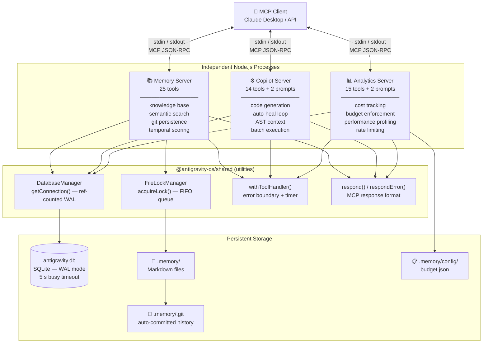
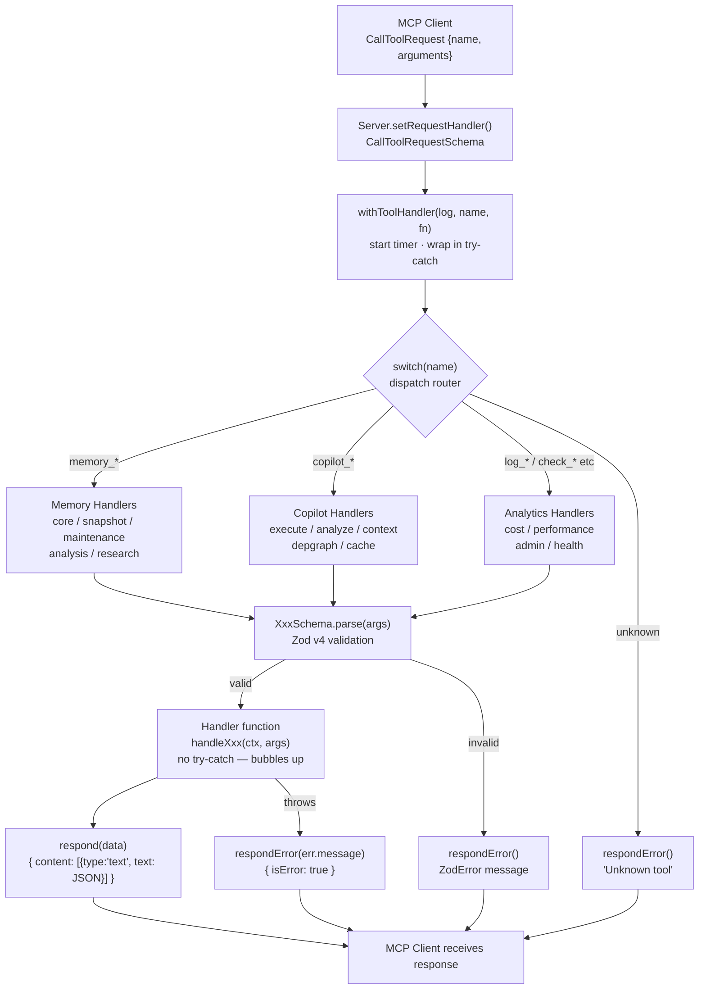
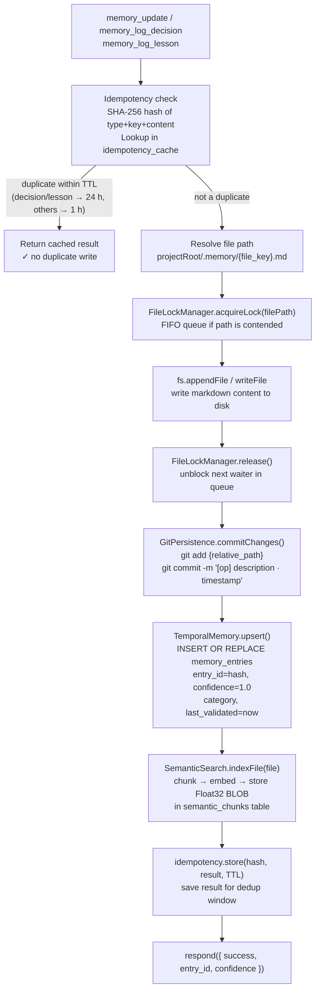
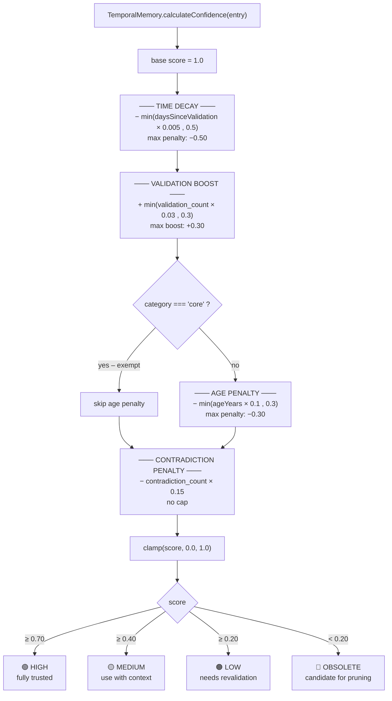
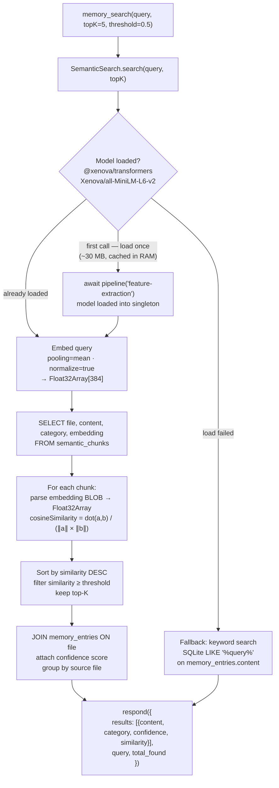
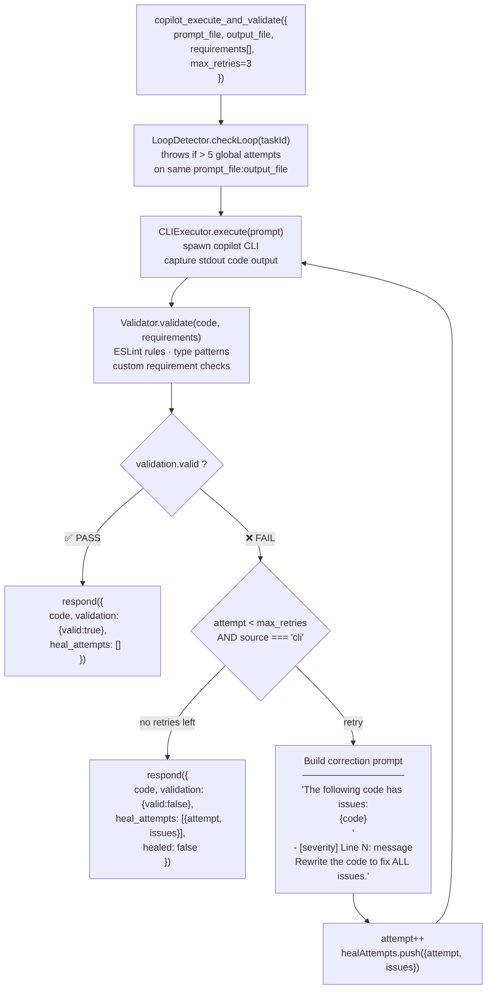
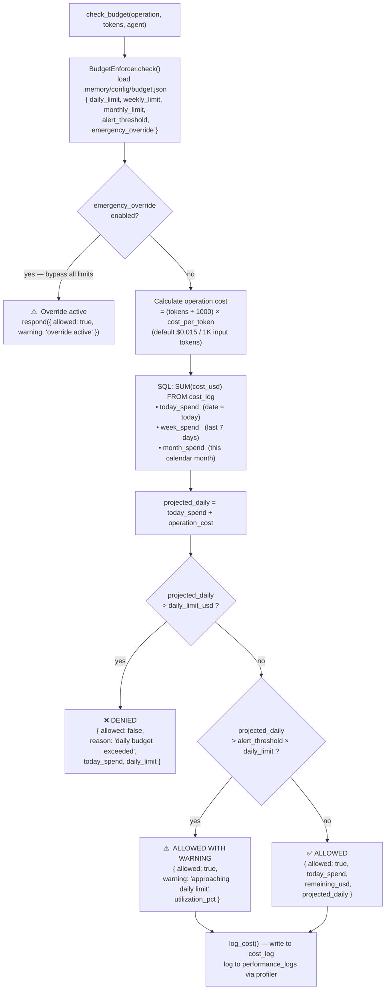
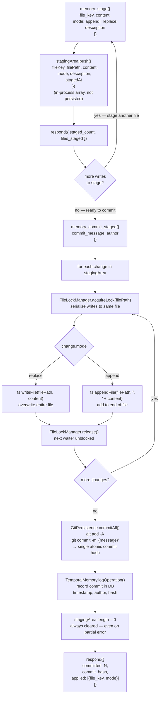
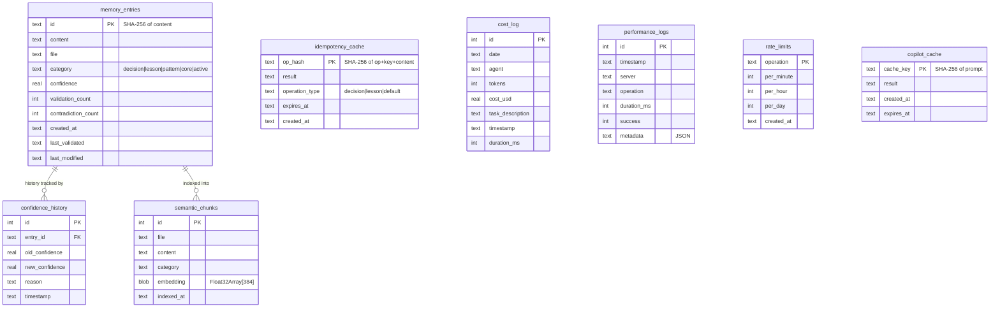
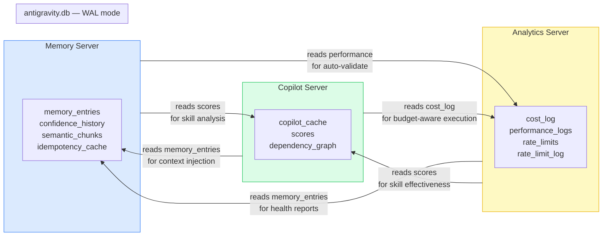

# Antigravity OS — System Flowcharts

A full visual reference of how every part of the system works, from MCP client connection down to SQLite writes.

---

## 1. System Overview

Three independent Node.js processes share a single SQLite database and communicate with MCP clients via stdio.

---

## 2. Tool Call Dispatch Flow

Every tool call travels the same pipeline: MCP transport → Zod validation → router → handler → formatted response.

---

## 3. Memory Write Lifecycle

Every write to the knowledge base is deduplicated, file-locked, git-committed, and semantically indexed.

---

## 4. Confidence Score Calculation

Each memory entry has a score between 0 and 1 that decays over time and is boosted by validation.

---

## 5. Semantic Search Pipeline

Queries are embedded into a 384-dim vector and compared against every stored chunk via cosine similarity.

---

## 6. Auto-Heal Retry Loop

When `copilot_execute_and_validate` detects issues, it feeds the errors back into the CLI automatically.

---

## 7. Budget Enforcement Flow

Every API call is checked against per-day / week / month limits before being allowed.

---

## 8. Memory Staging & Atomic Commit

Stage multiple file changes in memory, then flush them all in a single git commit.

---

## 9. Database Schema

All three servers share one `antigravity.db` file. Each server owns certain tables but reads freely from others.

---

## 10. Cross-Server Data Flow

How the three servers read from each other's tables to produce integrated results.

---

*Generated for Antigravity OS v2.2.1 — [Back to README](./README.md)*
